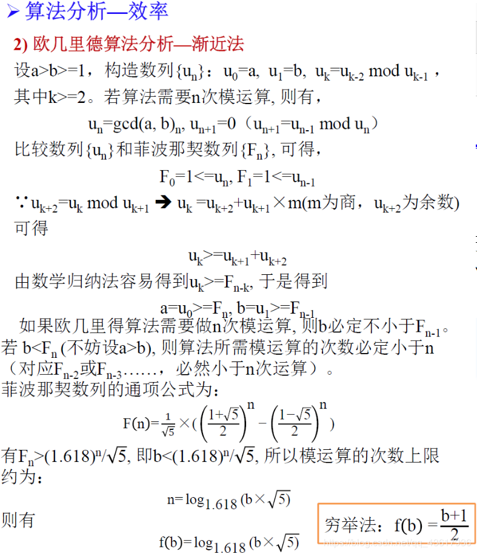

[toc]

# 欧几里得法求最大公约数

## 1.问题描述
求任意两个非负整数的最大公约数。
## 2.模型
符号规定： **gcd(a,b)**  表示a与b的最大公约数
则欧几里得算法可用以下模型描述：
```c
r = a%b
gcd(a,b)=gcd(b,r), r≠0
```
## 3.证明
假设a与b的一个公约数为d，则**d|a**， **d|b** 。（x|y 称作“x整除y”，其含义是“y是x的倍数”。例如 3|12，称作“3整除12”，其含义是“12是3的倍数”，这里分不清“除”和”除以“的小伙伴可能感觉有点乱，其实，我们小学学的那种叫”除以“   ：**12÷3=4** 读作 **12除以3等于4** 或者 **3除12等于4** ，找到感觉了吗？）

令r = a%b（a%b=r：即存在某个整数k，使得a=kb+r，且0≤r<|b|），即 a=kb+r。如果能够证明 d | r，就能说明 d也是(b,r)的公约数，又因为d是(a,b)的公约数，所以(a,b)的公寓数也是(b,r)的公约数，那双方的最大公约数肯定也相等了。所以问题焦点则转换为 **证明d|r** 。

这是显然的，因为 a=kb+r，所以r=a-kb。因为d|a，d|b，所以d|（a-kb），所以d|r。得证。


## 4.伪码描述
```c
r <- a%b   //伪代码中用“箭号”表示赋值
while r!=0
    a <- b
    b <- r
    r <- a%b
return b  //伪代码中用return表示输出
```

## 5.算法实现
**C语言**

```c
#include <stdio.h>
#include <stdlib.h>

/*******************************************
* 主题：算法学习
* 算法：欧几里得法求最大公约数
*   策略：迭代策略
*   输入：两个非负整数a,b,其中a和b不全为0
*   输出：a和b的最大公约数
* 
********************************************/

/******************函数声明******************/
int Euclid(int a, int b);

/******************主函数******************/

int main()
{
    int a, b;
    printf("Input two numbers(>=0):\n");
    scanf("%d%d", &a, &b);
    printf("gcd is %d.\n", Euclid(a, b));
    return 0;
}

/*****************函数定义区*****************/
int Euclid(int a, int b)
{
    int r = a % b;
    while (r)
    {
        a = b;
        b = r;
        r = a % b;
    }
    return b;
}
```


## 6.疑问解答

如果我输入两个数是，如果a比b小会怎样呢？

不妨是a=3，b=5，此时r=3%5 =3，然后执行赋值`a=b;b=r;` 此时 **a=5，b=3** ，怎么样，程序自动完成了大小数的交换！所以两个数的相对大小并不影响结果！


## 7.复杂度分析
盗用老师的一张图，分析用到了斐波那契数列。
